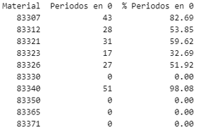

# Análisis de Gastos y Previsiones - Casa Tarradellas

## Descripción del Proyecto
Este proyecto realiza un análisis detallado de los gastos y previsiones de venta para Casa Tarradellas, utilizando técnicas avanzadas de análisis de datos y machine learning para optimizar la gestión de recursos y mejorar la precisión en las previsiones.

## Objetivos
- Analizar los patrones de gastos históricos
- Desarrollar modelos predictivos para la demanda
- Identificar oportunidades de optimización de costos
- Mejorar la precisión de las previsiones de venta

## Estructura del Proyecto
```
├── AnalisisCasaTarradellas07062025.ipynb    # Notebook principal de análisis
├── intermitencia_demanda.csv                # Datos de intermitencia de demanda
├── Previsions de venta 2025 3.xlsx         # Previsiones de venta para 2025
├── requirements.txt                         # Dependencias del proyecto
└── README.md                               # Este archivo
```

## Metodología
El análisis se ha realizado utilizando:
- Python para el procesamiento de datos
- Bibliotecas de análisis de datos (pandas, numpy)
- Técnicas de machine learning para predicción
- Visualización de datos para la presentación de resultados

## Resultados Principales

### 1. Intermitencia de la Demanda
- Algunos materiales presentan una alta proporción de periodos con ventas en cero, lo que indica una demanda intermitente o estacional.
- Ejemplos destacados:
  - Material 83307: 82.69% de los periodos sin ventas.
  - Material 83340: 98.08% de los periodos sin ventas.
  - Otros materiales como 83312, 83321 y 83326 también muestran más del 50% de periodos sin ventas.



### 2. Análisis de Series Temporales y Predicciones
- Se realizaron análisis de ventas semanales para cada material, comparando los datos reales con las predicciones del modelo.
- Para materiales con demanda intermitente, el modelo tiende a predecir valores promedio, mientras que los datos reales muestran picos esporádicos.
- Para materiales con demanda más estable, las predicciones se ajustan mejor a la realidad.


### 3. Visualización de Resultados
- Se generaron gráficos para cada material, mostrando la comparación entre ventas reales y predichas.
- Los materiales con alta intermitencia presentan ventas reales con muchos ceros y picos aislados, mientras que las predicciones son más constantes.
- Los materiales con ventas regulares muestran una mejor alineación entre los datos reales y las predicciones.


### 4. Recomendaciones
- Para materiales con alta intermitencia, se recomienda revisar la estrategia de inventario y considerar modelos de predicción específicos para demanda intermitente.
- Para materiales con ventas estables, el modelo actual es adecuado y puede utilizarse para la planificación de la producción y compras.

## Requisitos Técnicos
Para ejecutar este proyecto, se requieren las siguientes dependencias:
- Python 3.x
- Bibliotecas listadas en requirements.txt

## Instalación
1. Clonar el repositorio
2. Instalar las dependencias:
```bash
pip install -r requirements.txt
```

## Uso
El notebook principal `AnalisisCasaTarradellas07062025.ipynb` contiene todo el análisis y las visualizaciones. Para ejecutarlo:
1. Asegurarse de tener Jupyter Notebook instalado
2. Abrir el notebook en Jupyter
3. Ejecutar las celdas en orden

## Contacto
Para cualquier consulta sobre este análisis, por favor contactar al equipo de desarrollo.

## Notas Adicionales
- Los datos utilizados son confidenciales y propiedad de Casa Tarradellas
- Este análisis se realizó en junio de 2025
- Los resultados están sujetos a actualización según nuevos datos disponibles